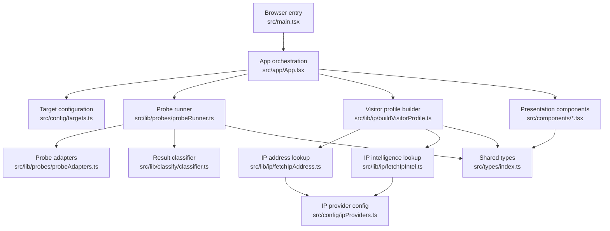

<!-- generated-by: gsd-doc-writer -->
# Architecture

## System overview
ipi is a browser-only React and Vite application that runs a network checkup from the visitor’s browser, samples a fixed set of domestic, global, and higher-friction web targets, and presents the results as grouped status cards plus a public IP profile. The system follows a lightweight layered frontend architecture: configuration defines probe targets and IP data providers, probe and IP libraries execute data collection, classification logic turns raw browser signals into user-facing verdicts, and React components render the aggregated snapshot.

## Component diagram


## Data flow
1. `src/main.tsx` mounts `App` and loads the shared stylesheet.
2. On initial render, `App` starts two independent browser-side workflows:
   - `buildVisitorProfile()` fetches IPv4 and IPv6 addresses, enriches them with provider metadata, and stores a summarized visitor profile in component state.
   - `startCheckup()` iterates through `TARGETS`, tracks the active target and attempt number, and calls `runAllProbes()`.
3. `runAllProbes()` processes targets with limited target-level concurrency. Retries within a single target remain sequential, and the final result list preserves target order.
4. `probeTarget()` dispatches to the correct adapter based on `probeType`. In the current configuration all targets use `fetch` probes with `mode: 'no-cors'`, timing each attempt and converting browser outcomes into normalized raw signals such as `opaque`, `error`, or `timeout`.
5. After each target finishes, `classifyProbeResult()` aggregates raw attempts into a `ProbeResult`, computing success rate, average latency for successful attempts, confidence, and a user-facing status such as `reachable`, `slow`, `challenging`, `timeout`, or `inconclusive`.
6. `App` stores completed results incrementally, derives grouped target panels from `GROUPS` and `TARGETS`, and passes the current snapshot into presentation components.
7. `GroupPanel`, `ResultRow`, `SummaryCards`, and `VisitorProfile` render the final dashboard, showing per-target outcomes, group progress, overall metrics, and the visitor’s public network identity.

## Key abstractions
- `App` — top-level orchestration component that owns run state, result state, visitor profile state, and initial auto-start behavior. `src/app/App.tsx`
- `Target` — configuration contract for a probeable endpoint, including URL, group, probe type, timeout, tags, and display metadata. `src/types/index.ts`
- `ProbeRawResult` — normalized shape for one probe attempt before classification, carrying signal, timing, and success data. `src/types/index.ts`
- `ProbeResult` — aggregated per-target result with derived status, confidence, latency, and success rate. `src/types/index.ts`
- `GroupMeta` — descriptive metadata used to label and explain each target group in the UI. `src/types/index.ts`
- `runAllProbes()` — limited-concurrency orchestration function that executes multiple attempts per target and emits progress callbacks for the UI. `src/lib/probes/probeRunner.ts`
- `probeTarget()` — adapter dispatcher that converts a configured target into a concrete browser probe strategy. `src/lib/probes/probeAdapters.ts`
- `classifyProbeResult()` — domain rule set that maps raw attempt patterns into user-facing network accessibility categories. `src/lib/classify/classifier.ts`
- `VisitorProfile` / `VisitorIpRecord` — typed model for IPv4/IPv6 public address discovery, enrichment, confidence, and summary display. `src/types/index.ts`
- `buildVisitorProfile()` — composition function that combines address discovery and IP intelligence enrichment into one UI-ready profile object. `src/lib/ip/buildVisitorProfile.ts`

## Directory structure rationale
The project is organized by responsibility so configuration, browser-side domain logic, and presentation remain easy to change independently.

```text
src/
├── app/          # Application-level orchestration and page composition
├── components/   # Reusable UI sections for grouped results, summary cards, and visitor profile panels
├── config/       # Static target lists and third-party IP provider definitions
├── lib/          # Non-UI logic for probes, result classification, and IP data collection
├── types/        # Shared TypeScript contracts used across UI and domain logic
├── main.tsx      # React entry point
├── styles.css    # Global dashboard styling
└── vite-env.d.ts # Vite type definitions
```

Top-level project directories outside `src/` follow the same separation:

- `public/` — static assets such as brand logos used by the dashboard.
- `tests/` — Vitest test coverage for classifier logic and UI components.
- `docs/` — generated project documentation.

This structure fits the application’s current scale well: static configuration drives probe coverage, `lib/` isolates network sampling behavior from rendering, and `components/` stays focused on presenting already-classified data rather than implementing probe rules.
